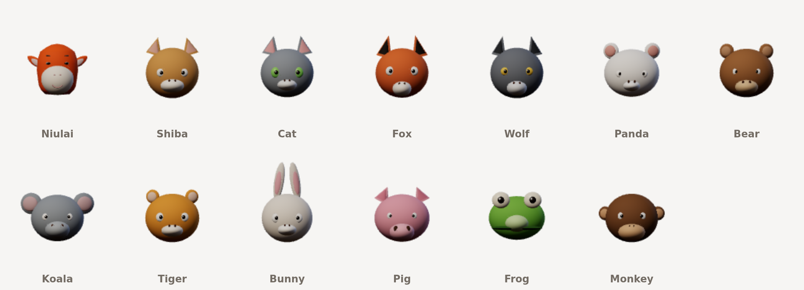

# Critter Cam

A Chrome extension that replaces your head with an animated animal, live in
your webcam feed — so Google Meet (and anything else in the browser) sends the
animal out to everyone on the call.

There is no virtual camera driver and nothing to install outside Chrome. The
extension intercepts `getUserMedia`, draws the animal head onto the camera
frames on a canvas, and hands the meeting the filtered stream instead.



## What it does

- **Five rigged 3D characters** — Niulai, Baola, Wolfwolf, NiuMama and
  NiuBaba —
  textured, with mouths that open onto a modelled interior, eyes that blink one
  at a time, and brows that lift.
- **Twelve more animals** built in — shiba, cat, fox, wolf, panda, bear, koala,
  tiger, bunny, pig, frog and monkey — all lit 3D, so the head has real volume
  and turns with you in three dimensions.
- **Bring your own model.** Drop a `.glb` in `models/avatars/` and it appears in
  the picker; `tools/` will crop a head out of a full body, shrink its textures
  and build the expression shapes if it arrived without a rig. See
  [docs/AVATAR-MODELS.md](docs/AVATAR-MODELS.md).
- **Real face tracking** with MediaPipe Face Landmarker: the head follows your
  position, size and tilt, turns with you, and its mouth, eyes and brows follow
  your own.
- **Runs in the meeting, not just the preview.** Everyone on the call sees the
  animal.
- **Fully offline.** The model and runtime are bundled; nothing is uploaded and
  no frame ever leaves your machine.

## Install it (no coding needed)

Chrome can run an extension straight from a folder on your computer. Nothing
here needs a terminal, an account, or any tool other than Chrome.

**1. Download the code.**
On this page, click the green **Code** button near the top, then
**Download ZIP**. It saves a file called something like
`niulai_filter-main.zip`.

**2. Unzip it.**
Double-click the file. On Windows, open it and choose **Extract all**; a folder
appears next to the zip. On a Mac it unzips beside the file on its own.

Put that folder somewhere you will not tidy away by accident — your Documents
folder is fine, your Downloads folder is not. **Chrome loads the extension from
this folder every time it starts, so moving or deleting it uninstalls the
extension.**

**3. Open Chrome's extensions page.**
Type `chrome://extensions` in the address bar and press Enter. (The menu route
is ⋮ → Extensions → Manage Extensions.)

**4. Turn on Developer mode.**
The switch is in the top-right corner of that page. Three buttons appear once
it is on.

**5. Click "Load unpacked", and choose the folder.**
Pick the folder that has `manifest.json` directly inside it. If you opened the
right one you will see folders named `src`, `icons` and `models` alongside that
file. A common slip is selecting the outer folder that merely *contains* the
real one — if Chrome complains that the manifest is missing, look one level
deeper.

**6. That is it.**
The live preview page opens by itself. Click **Start camera**, allow the camera
when Chrome asks, and pick an animal. Adjust **Head size** until your own head
is covered.

### Everyday use

Open the extension from the toolbar to change animals or nudge the fit —
changes apply live, mid-call. If you do not see its icon, click the puzzle-piece
button in the toolbar and pin **Critter Cam**.

### Things worth knowing

- **Chrome shows a warning about developer-mode extensions** each time it
  starts, and may ask you to confirm. That is Chrome's standard notice for any
  extension not installed from the Web Store; clicking *Keep* is fine.
- **Reload your meeting tab after installing.** The filter attaches to the
  camera as a page loads, so a tab that was already open will not have it.
- **To update**, download the ZIP again, replace the folder with the new one,
  then press the ↻ **Reload** button on the extension's card at
  `chrome://extensions`.
- **To remove it**, click **Remove** on that card. Deleting the folder alone
  leaves a broken entry behind.

### Installing from a clone instead

If you have git, `git clone` the repository and load that folder at step 5
above. `npm install` is only needed to run the tests and the model tooling; the
extension itself has no build step.

## Use it in Google Meet

1. Open or reload **meet.google.com**. The filter hooks the camera as the page
   loads, so a tab that was already open needs a reload.
2. Join and turn your camera on. Your self-view shows the animal head, and that
   is exactly what the other participants receive.
3. Change animals or nudge the fit from the toolbar popup at any time — changes
   apply live.

Also works on Zoom web, Microsoft Teams, Webex, Whereby, Discord and Gather.
Native desktop apps cannot be filtered this way; use the browser version of the
meeting.

To add another site, add its URL pattern to `host_permissions`, both
`content_scripts` entries and `web_accessible_resources` in `manifest.json`.

## Publishing

`docs/CHROME-WEB-STORE.md` covers packaging and the store listing.

```bash
npm run package      # dist/critter-cam-<version>.zip, validated before it builds
npm run store:shots  # screenshots at 1280x800
npm run store:promo  # store icon and both promo tiles
```

## Troubleshooting

| Symptom | Cause |
| --- | --- |
| The meeting shows my real face, but the preview page is fine | The tab was open before the extension loaded, or before you reloaded it — the camera is hooked as the page loads. Reload the meeting tab. If it persists, open the popup on that tab: it reports whether the content script is present, whether the camera was intercepted, and what the face tracker is doing. |
| The head appears, then fades away | Face tracking stopped or never found a face. The popup shows the tracker's state and its cost per frame; *Advanced → When the face is lost* controls what happens next. |
| Chrome says the manifest is missing, or the folder is invalid | You picked the wrong folder level. Choose the one with `manifest.json` sitting directly inside it, next to `src` and `icons` — often one level deeper than the folder the zip produced. |
| The extension vanished, or its card shows an error, after a restart | Chrome loads it from wherever the folder is. Moving, renaming or deleting that folder breaks it. Put the folder back, or remove the card and load it again. |
| I cannot find the toolbar button | Click the puzzle-piece icon in Chrome's toolbar, find **Critter Cam**, and click the pin beside it. |
| Chrome keeps warning about developer-mode extensions | Expected for anything loaded from a folder rather than the Web Store. Choosing *Keep* leaves it running. |
| The head covers only part of my face | Raise **Head size** in the popup until you are covered, then use *Up / down* and *Left / right* to centre it. |

## Settings

| Setting | What it does |
| --- | --- |
| 3D avatar | Lit 3D model. Turn it off for flat art — lighter on old machines, and the automatic fallback where WebGL is unavailable. |
| Head size | Head width as a multiple of your detected face width. Raise it until your own head is fully covered. |
| Up / down, Left / right | Nudges the head off the detected face centre. |
| Forward / back | Moves the head along the axis you look down. The camera is orthographic, so this changes nothing while you face it — what it moves is the point the head turns about, which is what to reach for when turning your head swings the avatar too far or too little. 3D only. |
| Tilt with my head | Rotates the animal as you tilt. |
| Mouth & eyes follow me | Drives the mouth, blinks and brows from your expression. |
| Smoothing | Higher is calmer but lags slightly; lower snaps to the tracker. |
| Tracking rate | Face detections per second. Lower it to save CPU. |
| When my face is lost | Fade out, stay put, or hide immediately. |
| Pin in place | Skips tracking entirely and parks the head at a fixed spot. Useful on slow machines. |
| Show tracker overlay | Draws the tracker box and pose numbers — for debugging fit. |

## How it works

```
Google Meet
    │  navigator.mediaDevices.getUserMedia()
    ▼
src/page/patch.js          MAIN world — swaps in a canvas stream
    │  real camera track → hidden <video> → <canvas> → captureStream()
    │                                          ▲
    │                            src/core/compositor.js draws the head
    │                                          │ smoothed pose
    ├── postMessage ──► src/content/bridge.js  │  isolated world
    │                        │                 │
    │                        ▼                 │
    │            src/core/detector.worker.js ──┘
    │            MediaPipe Face Landmarker on extension-origin worker
    ▼
filtered MediaStream → the meeting
```

Three details are load-bearing:

- **The patch runs in the page's MAIN world** at `document_start`, because it
  has to replace `getUserMedia` before the meeting app captures a reference to
  it. That world has no `chrome.*` APIs, so settings and face poses arrive by
  `postMessage` from the content-script bridge.
- **The detector's worker is built from a blob, not from an extension URL.** An
  isolated world creates workers against the *page's* origin, so
  `new Worker('chrome-extension://…')` is refused outright on a real site — and
  a page-origin worker then cannot reach back across to `chrome-extension://`
  for anything either. The content script reads every piece it needs (the
  vision bundle, the worker, the wasm glue and binary, the face model) and
  hands them over, with the glue inlined so MediaPipe's `importScripts` is
  answered from inside. Extension pages skip all of that and load the worker
  from its URL. It is a *classic* worker either way: module workers have no
  `importScripts`.
- **The camera is never dropped on failure.** If the pipeline cannot start, the
  original camera stream is handed back untouched rather than a black frame.

## Development

```bash
npm install          # Playwright, for the dev tools only
npm run test:pose    # head-pose geometry checks, no camera needed
npm run test:smoke   # loads the extension in Chromium with a fake camera
npm run icons        # regenerates icons/*.png from the default avatar
```

`tools/smoke-test.mjs` is the useful one: it loads the unpacked extension,
checks that the MediaPipe worker starts, that `getUserMedia` is intercepted on
a real host page, and that the animal head reaches the outgoing stream. It
writes screenshots to `.smoke/`.

### Using your own 3D model

The extension can render an imported glTF head instead of a built-in animal.
Drop a `.glb` into `models/avatars/`, add an entry to
`models/avatars/index.json`, and it appears in the picker.

To iterate without bundling anything, open the live preview page and pick a
file under **Imported model** — it loads immediately and reports what the
loader found:

```
size  1.04 x 1.31 x 0.98  (scaled by 0.962)
jaw   1 morph target(s)
blink 1 left, 1 right
```

The loader measures and re-centres whatever it is given, so a model does not
have to be authored at a particular scale, and it matches morph targets by
name against ARKit, Ready Player Me and plain-English conventions — a head
exported from most pipelines animates without configuration.

**[docs/AVATAR-MODELS.md](docs/AVATAR-MODELS.md) is the full specification**:
format, orientation, budget, rig naming, registry fields and troubleshooting.

To commission a model, hand [docs/MODEL-BRIEF.md](docs/MODEL-BRIEF.md) to a
modeller or a 3D-generating agent alongside your own description of the
character — the brief covers the file requirements only. Check what comes back
before wiring it in:

```bash
npm run validate:avatar -- path/to/head.glb
```

The validator reports bounds, triangle count and which expression channels it
found, and fails on anything that would stop the model loading. A conforming
example is committed at `docs/reference/example-head.glb`
(`npm run example:avatar` regenerates it).

### Adding an animal

Animals in `src/core/animals.js` are data, not drawing code. Copy an entry in
`SPECS` and change the palette and the ear/eye/muzzle numbers. The picker, the
preview and the icons all pick it up automatically.

Each spec drives two renderers. `src/core/animals3d.js` builds a lit 3D head
from the same numbers, so a new animal gets a 3D model for free; add a
`model3d` block to override the derived proportions and a `build3d` function
for parts the generic builder has no concept of. The flat vector art in
`animals.js` stays as the fallback for machines without WebGL, where a
`markings` function adds anything distinctive.

The Three.js bundle in `vendor/three/` is built from `tools/three-entry/` with
`npm run build:three`; only the classes the renderer uses are pulled in.

## Privacy

Everything runs locally. The camera frames go to a canvas in your own browser,
the face model runs on your machine, and the extension makes no network
requests at all — it works with the network disconnected. The only stored data
is your settings, in `chrome.storage.sync`, which Chrome may copy between your
own signed-in browsers.

The full policy is in [PRIVACY.md](PRIVACY.md).

## Licence

MIT — see [LICENSE](LICENSE). Bundled MediaPipe components are Apache 2.0; see
[THIRD_PARTY_NOTICES.md](THIRD_PARTY_NOTICES.md).
