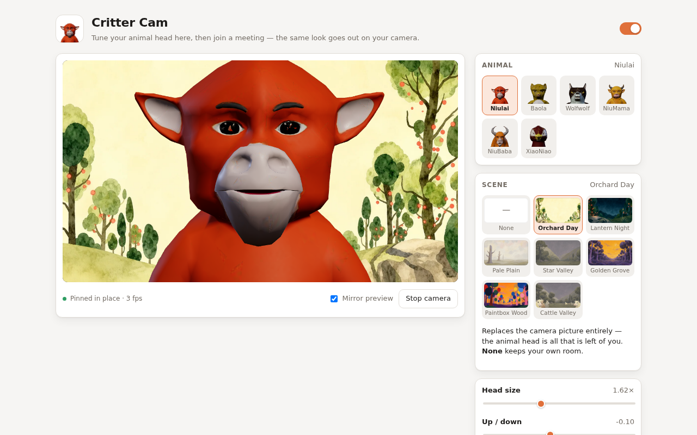
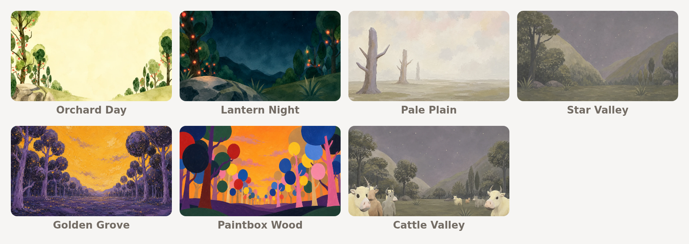

# Critter Cam

[English](README.md) · **简体中文**

一个 Chrome 扩展程序，把你的头换成会动的动物，直接作用在摄像头画面上——所以
Google Meet（以及浏览器里的其他会议网站）发出去给所有人看到的，就是那只动物。

不需要虚拟摄像头驱动，也不用在 Chrome 之外安装任何东西。扩展程序拦截
`getUserMedia`，在画布上把动物头画到摄像头画面上，再把处理后的视频流交给会议网站。

> 扩展程序的界面本身是英文的。下文提到按钮和设置项时，都会先写界面上的英文原文，
> 后面括注中文，方便你在界面上对照着找。



## 它能做什么

- **六个绑定好的 3D 角色**——Niulai、Baola、Wolfwolf、NiuMama、NiuBaba 和
  XiaoNiao——都带贴图，嘴张开时露出建模出来的口腔内部，眼睛可以单只眨，眉毛会抬。

  

- **也可以用你自己的模型。** 把 `.glb` 放进 `models/avatars/`，它就会出现在选择器
  里；`tools/` 里的工具能从整个身体裁出头部、压缩贴图，如果模型没有绑定表情，还能
  帮它生成表情形态。详见 [docs/AVATAR-MODELS.md](docs/AVATAR-MODELS.md)。
- **真正的面部追踪**，基于 MediaPipe Face Landmarker：头会跟着你的位置、大小和倾斜
  移动，跟着你转向，嘴、眼睛和眉毛也跟着你动。
- **七张手绘场景。** 选一张，它会整个替换掉摄像头画面——别人只看得到那只动物的头，
  背后是你选的画面，你房间里的任何一个像素都不会进入会议。

  

- **在会议里真的生效，不只是预览。** 通话中每个人看到的都是那只动物。
- **完全离线。** 模型和运行时都打包在扩展程序里，什么都不会上传，任何一帧画面都不会
  离开你的电脑。

## 安装（不需要写代码）

Chrome 可以直接从电脑上的一个文件夹运行扩展程序。下面这些步骤不需要用命令行、不需要
注册账号，除了 Chrome 之外什么工具都不用。

**1. 下载代码。**
在本页面上方点绿色的 **Code** 按钮，然后选 **Download ZIP**。会下载到一个类似
`niulai_filter-main.zip` 的文件。

**2. 解压。**
双击这个文件。Windows 上打开它并选择「全部解压」，压缩包旁边会出现一个文件夹；
macOS 上双击后会自动解压到旁边。

把这个文件夹放在你不会顺手清理掉的地方——「文档」里可以，「下载」里不行。
**Chrome 每次启动都会从这个文件夹加载扩展程序，所以移动或删除它就等于卸载。**

**3. 打开 Chrome 的扩展程序页面。**
在地址栏输入 `chrome://extensions` 回车。（也可以走菜单：⋮ → 扩展程序 → 管理扩展程序。）

**4. 打开右上角的 Developer mode（开发者模式）。**
开关在这个页面的右上角。打开后会多出三个按钮。

**5. 点 "Load unpacked"（加载已解压的扩展程序），选择那个文件夹。**
要选**直接包含 `manifest.json` 的那一层**。选对了的话，你会看到 `src`、`icons`、
`models` 这几个文件夹和它并排。最常见的失误是选了外面那层「装着」正确文件夹的目录
——如果 Chrome 提示找不到 manifest，往里再点一层。

**6. 完成。**
预览页会自动打开。点 **Start camera**（开启摄像头），在 Chrome 询问时允许使用摄像头，
然后挑一个动物。调整 **Head size**（头部大小）直到完全盖住你自己的头。如果你不想让
别人看到你所在的房间，就在 **Scene**（场景）里选一张。

### 日常使用

点工具栏上的扩展程序图标就能换动物、换场景或微调位置——修改会立刻生效，通话中也可以改。
如果找不到图标，点工具栏上的拼图按钮，把 **Critter Cam** 固定住。

### 几件值得知道的事

- **Chrome 每次启动都会提示「已停用开发者模式扩展程序」之类的警告**，有时还会让你确认。
  这是 Chrome 对所有非应用商店安装的扩展程序的标准提示，选「保留」就行。
- **装好之后要重新加载会议标签页。** 过滤器是在页面加载时挂到摄像头上的，所以已经打开
  着的标签页不会生效。
- **更新**：重新下载 ZIP，用新文件夹替换旧的，然后在 `chrome://extensions` 上点这个
  扩展程序卡片里的 ↻ **Reload**（重新加载）。
- **卸载**：点卡片上的 **Remove**（移除）。只删文件夹会留下一个报错的条目。

### 也可以用 git clone

如果你会用 git，`git clone` 这个仓库，在上面第 5 步选这个文件夹即可。`npm install`
只是运行测试和模型工具时才需要；扩展程序本身不需要任何构建步骤。

## 在 Google Meet 里使用

1. 打开或重新加载 **meet.google.com**。过滤器在页面加载时接管摄像头，所以已经打开的
   标签页需要刷新一次。
2. 加入会议并打开摄像头。你自己的预览画面里是动物头，其他参会者收到的也正是这个画面。
3. 随时可以从工具栏弹窗里换动物或微调位置，修改立即生效。

Zoom 网页版、Microsoft Teams、Webex、Whereby、Discord 和 Gather 也都能用。桌面客户端
（原生应用）没法用这种方式处理，请改用会议的浏览器版本。

要增加别的网站，把它的网址模式加到 `manifest.json` 里的 `host_permissions`、两条
`content_scripts` 以及 `web_accessible_resources` 中。

## 发布

打包和商店信息见 `docs/CHROME-WEB-STORE.md`。

```bash
npm run package      # dist/critter-cam-<版本号>.zip，打包前会先校验
npm run store:shots  # 三张 1280x800 截图，外加 docs/preview.png
npm run store:promo  # 商店图标和两张宣传图
```

## 疑难排查

| 现象 | 原因 |
| --- | --- |
| 会议里还是我的真脸，但预览页是正常的 | 这个标签页在扩展程序加载之前（或你重新加载扩展程序之前）就已经打开了——摄像头是在页面加载时被接管的。刷新会议标签页。如果还不行，在那个标签页上打开弹窗：它会显示内容脚本有没有注入、摄像头有没有被接管、以及面部追踪的状态。 |
| 头出现了一下就淡出消失 | 面部追踪停了，或者一直没找到人脸。弹窗里会显示追踪器的状态和每帧耗时；*Advanced → When my face is lost*（高级 → 找不到人脸时）决定接下来的行为。 |
| Chrome 说找不到 manifest，或者文件夹无效 | 选错了目录层级。要选 `manifest.json` 直接放在里面的那一层，和 `src`、`icons` 并排——通常比压缩包解压出来的那层再深一级。 |
| 重启之后扩展程序不见了，或者卡片上报错 | Chrome 是从那个文件夹的原位置加载的。移动、重命名或删除它都会让扩展程序失效。把文件夹放回去，或者移除卡片重新加载一次。 |
| 找不到工具栏上的按钮 | 点 Chrome 工具栏上的拼图图标，找到 **Critter Cam**，点旁边的图钉固定住。 |
| Chrome 一直警告开发者模式扩展程序 | 只要是从文件夹加载而不是从应用商店安装的，都会这样。选「保留」它就会继续运行。 |
| 动物头只盖住了我的一部分脸 | 在弹窗里调大 **Head size**（头部大小）直到盖住，再用 *Up / down*（上下）和 *Left / right*（左右）把它移正。 |

## 设置项

| 设置 | 作用 |
| --- | --- |
| Scene（场景） | 用七张手绘背景之一整个替换摄像头画面。反正动物头本来就盖在你脸上，所以背后不会保留你的任何部分——你的身体也一起被替换掉。选 **None**（无）则保留你自己的房间。 |
| 3D avatar（3D 形象） | 带光照的 3D 模型。关掉会改用平面画法——在老机器上更省，也是没有 WebGL 时的自动兜底方案。 |
| Head size（头部大小） | 头的宽度相对于检测到的人脸宽度的倍数。调大到完全盖住你自己的头为止。 |
| Up / down、Left / right（上下、左右） | 相对检测到的人脸中心微调位置。 |
| Forward / back（前后） | 沿你视线方向移动头部。相机是正交投影，所以你正对镜头时看不出变化——它移动的是头部转动时绕的那个轴心。当你转头时形象转得过多或过少，就调这个。仅 3D 模式有效。 |
| Tilt with my head（跟随头部倾斜） | 你歪头时动物也跟着转。 |
| Mouth & eyes follow me（嘴和眼睛跟随） | 用你的表情驱动嘴、眨眼和眉毛。 |
| Smoothing（平滑） | 调高更稳但会略有延迟；调低则紧跟追踪结果。 |
| Tracking rate（追踪频率） | 每秒检测人脸的次数。调低可以省 CPU。 |
| When my face is lost（找不到人脸时） | 淡出、留在原地，或立刻隐藏。 |
| Pin in place（固定不动） | 完全跳过追踪，把头固定在一个位置。适合性能吃紧的机器。 |
| Show tracker overlay（显示追踪框） | 画出追踪框和姿态数值——用来调试贴合度。 |

## 工作原理

```
Google Meet
    │  navigator.mediaDevices.getUserMedia()
    ▼
src/page/patch.js          MAIN world —— 换成画布视频流
    │  真实摄像头轨道 → 隐藏的 <video> → <canvas> → captureStream()
    │                                          ▲
    │                            src/core/compositor.js 画出动物头
    │                                          │ 平滑后的姿态
    ├── postMessage ──► src/content/bridge.js  │  隔离世界
    │                        │                 │
    │                        ▼                 │
    │            src/core/detector.worker.js ──┘
    │            MediaPipe Face Landmarker，跑在扩展程序源的 worker 里
    ▼
处理后的 MediaStream → 会议
```

有四个细节是关键：

- **补丁跑在页面的 MAIN world 里**，而且是在 `document_start` 阶段，因为它必须赶在会议
  应用拿到 `getUserMedia` 的引用之前把它替换掉。那个环境里没有 `chrome.*` API，所以设置
  和人脸姿态都是通过 `postMessage` 从内容脚本桥接过来的。
- **检测器的 worker 是用 blob 构造的，不是用扩展程序的 URL。** 隔离世界创建 worker 时用的
  是*页面*的源，所以在真实网站上 `new Worker('chrome-extension://…')` 会被直接拒绝——而一个
  页面源的 worker 也没法反过来去访问 `chrome-extension://` 上的任何东西。所以由内容脚本把
  需要的每一样东西都读出来（vision 包、worker、wasm 胶水层和二进制、人脸模型）再传过去，
  其中胶水层是内联进去的，这样 MediaPipe 的 `importScripts` 在内部就能得到响应。扩展程序
  自己的页面不需要这一套，直接用 URL 加载 worker。两种情况下用的都是*经典* worker：模块
  worker 里没有 `importScripts`。
- **场景不需要人像分割。** 不管背后是什么，头都盖在你脸上，所以选中的场景只是直接替换掉
  整帧画面，而不是抠出你再合成到背景前面。这样每帧就是一次 `drawImage`，而不是再跑一个
  模型——这也正是你的身体会跟着房间一起消失的原因。
- **出问题时绝不会把摄像头弄丢。** 如果整条管线起不来，交回去的是原始摄像头视频流，而不是
  一片黑。

## 开发

```bash
npm install          # Playwright，只有开发工具用得上
npm run test:pose    # 头部姿态几何计算的检查，不需要摄像头
npm run test:smoke   # 用假摄像头在 Chromium 里加载扩展程序
npm run icons        # 从默认形象重新生成 icons/*.png
npm run showcase     # 重新生成 docs/animals.png 和 docs/scenes.png
```

其中最有用的是 `tools/smoke-test.mjs`：它加载解压版扩展程序，检查 MediaPipe worker 有没有
启动、`getUserMedia` 在真实宿主页面上有没有被拦截、以及动物头有没有真的进入输出流。截图会
写到 `.smoke/`。

### 使用你自己的 3D 模型

扩展程序可以渲染导入的 glTF 头部模型。把 `.glb` 放进 `models/avatars/`，在
`models/avatars/index.json` 里加一条记录，它就会出现在选择器里。

如果想边改边看、不想每次都打包，可以打开预览页，在 **Imported model**（导入模型）下面选
一个文件——它会立刻加载，并报告加载器读到了什么：

```
size  1.04 x 1.31 x 0.98  (scaled by 0.962)
jaw   1 morph target(s)
blink 1 left, 1 right
```

加载器会自己测量并重新居中拿到的模型，所以模型不必按某个特定尺寸制作；它还会按名字匹配
形态目标（morph target），兼容 ARKit、Ready Player Me 以及普通英文命名习惯——大多数流程
导出的头部模型不用额外配置就能动起来。

**完整规范见 [docs/AVATAR-MODELS.md](docs/AVATAR-MODELS.md)**：格式、朝向、面数预算、
绑定命名、注册表字段和疑难排查。

如果要外包做模型，把 [docs/MODEL-BRIEF.md](docs/MODEL-BRIEF.md) 连同你自己对角色的描述
一起交给建模师或 3D 生成工具——这份简报只写文件方面的要求。拿到成品后先检查一下再接进来：

```bash
npm run validate:avatar -- path/to/head.glb
```

校验工具会报告包围盒、三角面数和它找到的表情通道，遇到会导致模型加载失败的问题就会报错。
一个符合规范的示例提交在 `docs/reference/example-head.glb`（`npm run example:avatar`
可以重新生成）。

### 增加一个角色

每个角色都是一个 glTF 模型。把 `.glb` 放进 `models/avatars/`，在
`models/avatars/index.json` 里加一条记录，选择器、预览页和缩略图就都会认到它：

```json
{ "id": "niulai", "name": "Niulai", "file": "niulai.glb",
  "scale": 1.676, "offset": [0, -0.44, 0], "rotation": [0, 0, 0], "tint": "#e0762a" }
```

`scale` 和 `offset` 用来确定头在你裁出来的那块模型里的位置——半身像需要设置，只有头部的
模型通常不用，因为加载器会自己测量并居中。详见
[docs/AVATAR-MODELS.md](docs/AVATAR-MODELS.md)。

项目最早那批用代码画出来的动物已经删掉了，`src/core/animals.js` 里的 `SPECS` 现在是空的。
这个文件里保留下来的是平面矢量渲染器，用来在没有 WebGL 时、以及模型数据还没到达的那一
瞬间画一个中性的头。

`vendor/three/` 里的 Three.js 包由 `tools/three-entry/` 通过 `npm run build:three` 构建，
只打包渲染器实际用到的类。

## 隐私

所有处理都在本地完成。摄像头画面进的是你自己浏览器里的一块画布，人脸模型跑在你自己的机器
上，扩展程序不发起任何网络请求——断网也能正常工作。唯一被保存的数据是你的设置，存在
`chrome.storage.sync` 里，Chrome 可能会在你自己登录的多台浏览器之间同步它。

完整政策见 [PRIVACY.md](PRIVACY.md)。

## 许可

MIT——见 [LICENSE](LICENSE)。打包进来的 MediaPipe 组件采用 Apache 2.0 许可；见
[THIRD_PARTY_NOTICES.md](THIRD_PARTY_NOTICES.md)。
